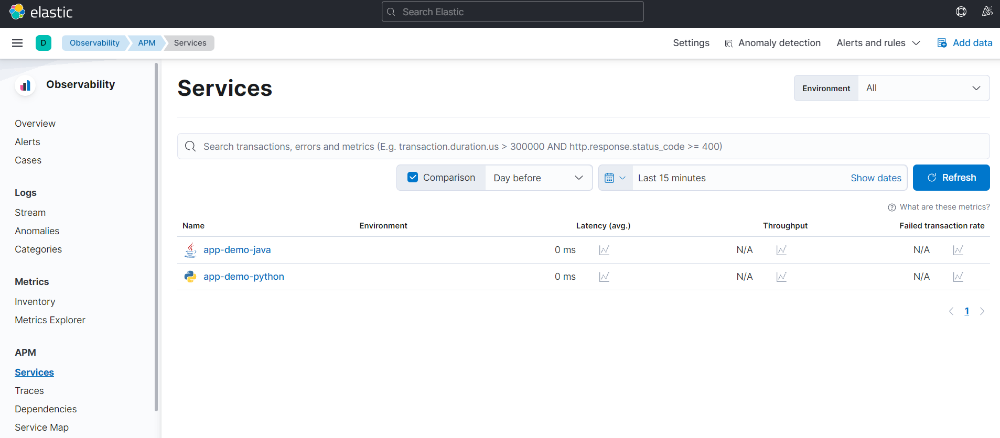
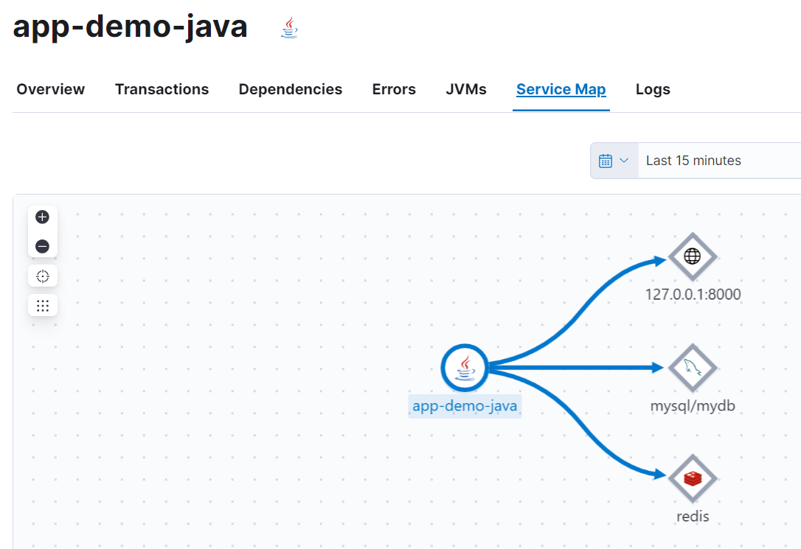
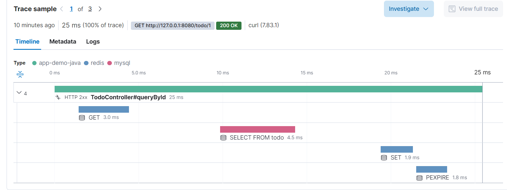

# Demo Elastic APM

In this demo, I will show you how our applications work with Elastic APM (Application Performance Monitoring) from Elasticseach to help us on distributed tracing.

## Launch Test Environmet

Execute docker compose command to luanch the test environment.
```
docker-compose up -d
```

Launch the two applications
- Java Application : refer to ./app-demo-java/README.md
- Python Application :  refer to ./app-demo-python/README.md


The services include:

- elasticsearch (port:9200)
- kibana (port:5601)
- apm-server : port=8200. Collect metrics from applications to deeply understand their performance and depencies.
- mysql (port:3306)
- redis (port:6379)
- app-demo-java (port:8080) : The demo Java application.
- app-demo-python (port:8000) : The demo Python application.


Execute the script to simulate the HTTP requests
```
simulate_request.sh
```

After launch, browse Kibana website 

http://http://127.0.0.1:5601/app/apm/services 

You can see the services' metrics and dependencies as below








## Close Test Environment

```
docker-compose down
```

Also, shutdown the Java and python Application.


## Node
To communicate with Elastic APM server, we need to set APM secret key for all of them. In this example, we use
`set_your_secret_key_for_APM_server`, please change in your production.

## Appendix

Reference :
- https://www.elastic.co/guide/en/apm/server/7.15/overview.html
- https://levelup.gitconnected.com/how-to-integrate-elastic-apm-java-agent-with-spring-boot-7ce8388a206e